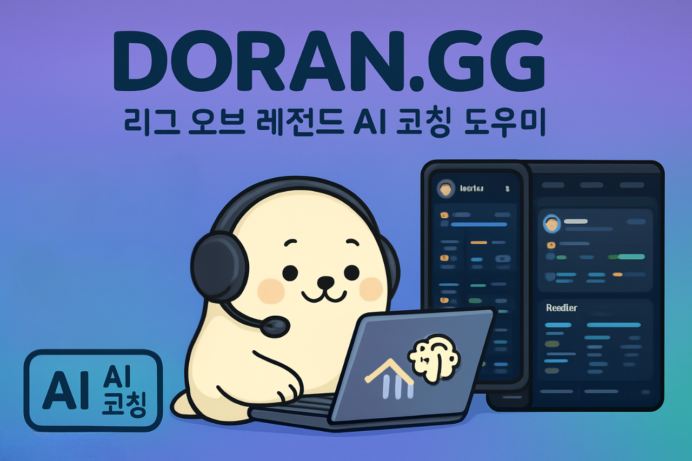
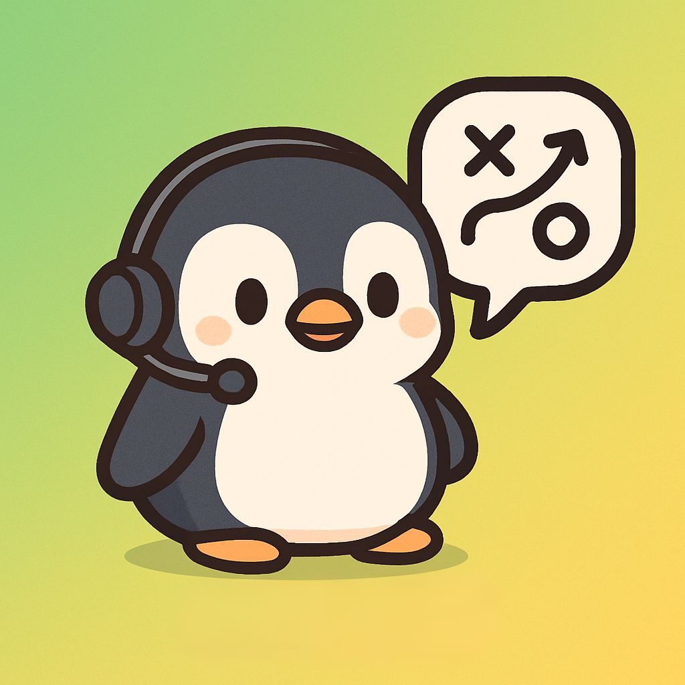
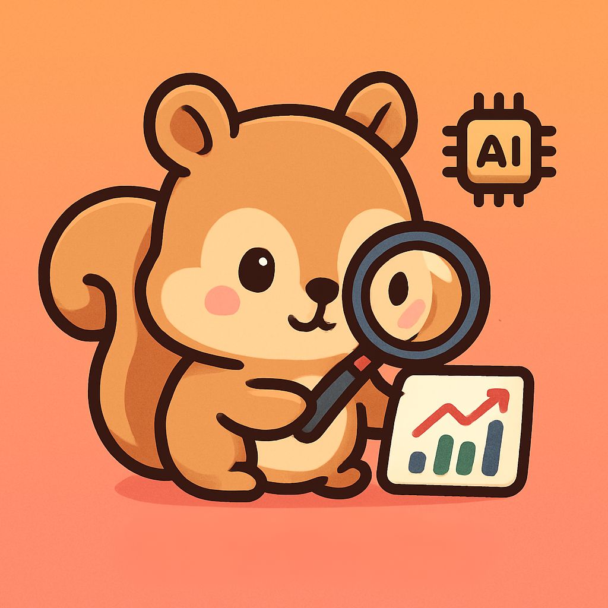
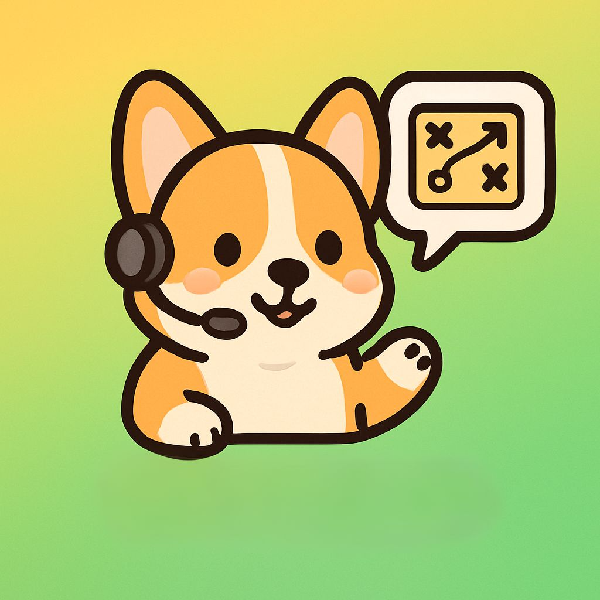

<h1 align="center">DORAN.GG</h1>
<h3 align="center">리그오브레전드 AI 코칭 도우미</h3>

  
  
  
  

---

## 📌 프로젝트 소개

**doran.gg Project**는 **게임 데이터 분석**, **Todo 관리**, **커뮤니티 기능**, **오픈 채팅**, **AI 기반 요약 및 추천**을 하나로 통합한 백엔드 서버입니다.

Spring Boot와 JPA를 기반으로 구축되었으며, Riot API 연동으로 게임 데이터를 저장/분석합니다. 

Todo 리스트, 커뮤니티 게시판, 오픈 채팅, AI 요약 코멘트 등 다양한 기능을 모듈 단위로 분리하여 개발하였습니다.

매일 수백만 판이 진행되는 리그 오브 레전드. 하지만 유저들의 질문은 남습니다.

> **“나는 다음 판에 무엇을 바꿔야 하지?”**

유튜브 공략, 전적 사이트, 커뮤니티… 대부분은 일반적이거나 내 상황과 맞지 않습니다.  
**DORANGG** 은 당신의 플레이 데이터를 읽고, AI 코치가 **다음 판에서 바로 실천할 변화 하나**를 알려줍니다.  
복잡한 리포트 대신 **구체적이고 즉시 적용 가능한 코칭**을 제공합니다.

---

## 👥 팀원 소개

  <table>
    <tr>
      <td align="center" width="240">
         
        <b>도규경 (팀장)</b> 
        Riot API·Todo·마이페이지 리팩토링 및 코드최적화
      </td>
      <td align="center" width="240">
         
        <b>정유진</b> 
        Riot API · AI · Dashboard 문서화 · 마이페이지
      </td>
      <td align="center" width="240">
         
        <b>서동원</b> 
        기획 및 설계 · 도란챗봇 Riot API · 커뮤니티 · Frontend
      </td>
    </tr>
  </table>

---

## 🗂️ 주요 도메인

- **Member**  
  사용자 회원가입, 로그인, 회원탈퇴, 프로필 관리.  
  `Member` 엔티티 기반, **Spring Security + JWT**로 인증/권한 제어.

- **Todo**  
  할 일 등록 및 목표(`TodoGoal`)와 상태(`TodoStatus`) 관리.  
  `TodoRepository`/`TodoService` 기반 CRUD, `TodoCheckHistory`로 진행 이력 기록.

- **Riot**  
  Riot API로 게임 데이터 수집/저장.  
  `RiotUser`, `Match` 엔티티 기반 최근 전적 관리, `MatchStatSummary`로 통계 요약.  
  AI 하이라이트 요약/추천 코멘트 생성.

- **Community**  
  게시글(Post)·댓글(Comment) 관리.  
  `PostController` · `PostService` · `PostRepository` 구조, 유저 소통 지원.

- **OpenChat**  
  WebSocket + STOMP 기반 실시간 채팅.  
  `OpenChat` 엔티티로 채팅방 데이터 관리.

- **AI**  
  Spring AI 클라이언트로 게임 데이터 분석/하이라이트 요약.  
  `AiComment` 엔티티에 AI 코멘트 저장 후 제공.

---

## ✨ 주요 기능 요약

- **회원 시스템**: 회원가입, 로그인, 프로필 관리, **JWT 인증**
- **Todo 관리**: 할 일 생성/조회/수정/삭제, **목표 관리**, **체크 이력 기록**
- **Riot API 연동**: 전적 데이터 저장, **매치 통계 요약**, **AI 추천 생성**
- **커뮤니티**: 게시글 (비로그인도 조회 가능)
- **오픈 채팅**: **실시간 WebSocket** 기반 채팅
- **AI 분석**: 하이라이트 요약, **AI 코멘트 저장**
- **도란 AI 봇**: 전적 데이터 기반 **LoL 특화 AI 코칭**

---

## 🚀 기술 스택

### 💻 Framework & Language

### 🔧 Backend

### 🖼️ Frontend

### 🗄️ Database & Storage

### 🧰 Tools

### ☁️ Infra & Deployment

### 🔗 External API

---

## 🧭 기능 상세

### 1) 리그 오브 레전드 전적검색 시스템
초보자도 쉽게 접근할 수 있는 **모든 게이머를 위한 AI 전적검색**.  
사용자의 **매치 데이터기반 AI 응답 정확도**를 향상.  
유저명과 태그를 입력하면 자동 오케스트레이션으로 **정확한 AI 응답**, **총 6개 위젯**으로 구성.

### 2) 전적을 한눈에 보는 AI 대시보드
#### Dashboard Cards 포지션, 챔피언, 티어, 승률, 숙련도, 연승/연패 등 핵심 지표 한눈에.
- **📝 Daily Briefing**: 최근 경기 전적 요약으로 하루 흐름 파악.
- **🎮 Strategy Briefing**: 부족했던 부분 기반 **다음 판 개선 전략 1~2개** 제안.
- **🛡️ Build Briefing**: 주력 챔피언의 **아이템/룬 빌드 개선 방향** 추천.
- **🧭 포지션**: 주 포지션과 포지션별 경기 비율 제공.
- **🏹 자주하는 챔피언**: 대표 챔피언/숙련도 기반 주력 챔피언 식별.
- **🏆 티어**: 현재 랭크 티어와 승급/강등 추적.
- **📈 승률**: 최근 N경기 승률 및 연승/연패 흐름 분석(멘트 제공).
- **🔥 챔피언 숙련도**: 강점/보완점 진단.
- **⚡  연승/연패**: 동기부여 멘트 제공.

### 3) 목표 설정 (Todo & Goals)
- 로그인 후 개인 전용 목표 공간 제공.
- 상태값: **시작 전 / 진행 중 / 완료 / 실패**.
- 목표 내부에 원하는 **체크리스트** 추가/관리.
- 체크리스트 선택으로 **달성 여부** 손쉽게 확인.
- 기능:
    - ✍️ **Todo 생성**: 제목/내용/마감일 입력
    - 📖 **Todo 조회**: 목록 조회
    - 📝 **Todo 수정**: 제목/내용/마감일/상태(PENDING → COMPLETED) 변경
    - ❌ **Todo 삭제**: 무결성 유지
    - ✅ **Todo 체크**: 소유자만 체크 수행, 목표와 연동

### 4) 커뮤니티
- 게시글 기능과 오픈채팅을 겸비한 서비스.
- 회원가입한 유저 사용, **JWT 토큰 인증**.
- 토큰 만료 시 즉시 중단 처리.

### 5) 게시글
- 플레이 경험 기록 및 소통 공간.
- 글 작성/조회/수정/삭제 가능.
- **검색/정렬**로 원하는 글 빠르게 탐색 → 활발한 교류 지원.
- (비로그인도 조회 가능)

### 6) 오픈채팅
- 일반 채팅/랭크 채팅 제공.
- 리소스 최적화: 접속 시 **최근 200자만** 우선 로드, 과거 일자별 **점진적 조회**로 부하 절감.
- 예시:
    - “브론즈인데 같이 게임하실 분?”
    - “버스 태워드릴게요!”

### 7) 게임에 특화된 **도란봇**
- LoL 특화 AI.
- 사용자의 전적 데이터를 분석해 **현재 상태에 대한 정확한 응답** 제공.

### 8) 마이페이지
- 사이트 기능 이용을 위한 **회원가입/로그인 필수**.
- **탈퇴**: 회원 정보 삭제 + **JWT 블랙리스트**(Redis) 처리로 **토큰 사용 불가** 상태 보장.
- **로그인/로그아웃**: 로그인 시 JWT 발급, 편의를 위한 긴 유효기간.  
  로그아웃 시 해당 토큰을 Redis에 **사용 불가 처리**하여 **이중 로그인 안전 처리**.
- **회원가입**: 이메일 기반, **중복 이메일 불가**, **Password Encoder**로 보안 강화.

---

## 🔒 보안/인증
- Spring Security 기반 **Role/권한 관리**
- **JWT** 발급/검증, **Redis 블랙리스트**로 무효 토큰 차단
- 최소 권한 원칙, 민감 정보 분리

---

## 📐 ERD

  
V1

  
V2

---
## 📑 API 명세서

---

## 🏗️ 아키텍처

---

## 🎨 와이어프레임

---

### 참고/고지
- 본 프로젝트는 Riot Games의 API 및 데이터 정책을 준수합니다.
- 사용된 아이콘/로고는 각 상표권자의 소유입니다.

---